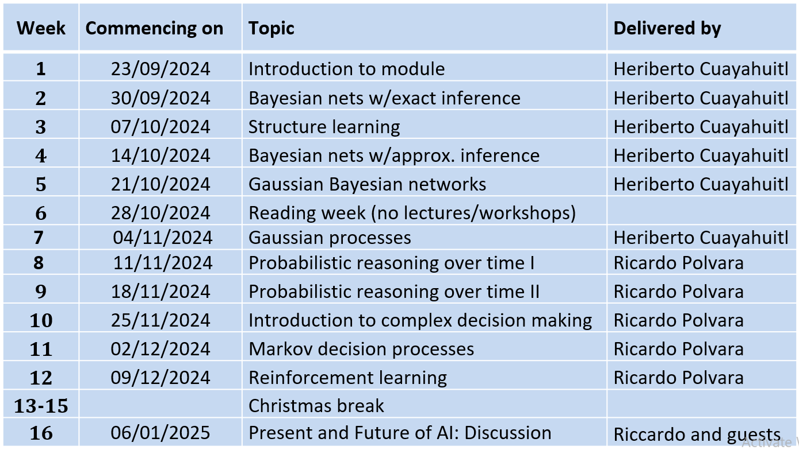

# CMP9794M
Repository hosting the code for UoL module CMP9794M (Advanced Artificial Intelligence). 

The PDF files are printouts of the exercises covered during each workshop using Blackboard -- the interactive version of the materials. You should attempt the exercises using Blackboard and submit your answers in order to receive feedback on your correct and incorrect responses. Don't worry about making mistakes, learning the conceptual and practical aspects of the materials is what matters! 

Contact info:
* hcuayahuitl@lincoln.ac.uk for questions related to the first 6 weeks of delivery.
* rpolvara@lincoln.ac.uk for questions related to the last 6 weeks of delivery.